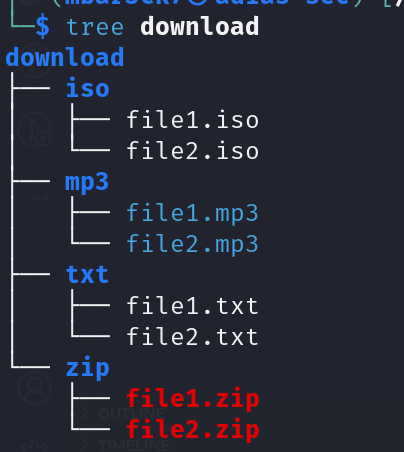

# Automation - bash scripting  

## tasks
- Write a bash script, to organize the Download folder by file extension 
- The script should create a folder per extension
- Move each file type to its created folder

## Example 
### Before running the script 


### After running the script


## Note
You can generate fake data to test with:

```
mkdir -p downloads \
&& cd downloads || exit \
&& touch file{1..7}.txt file{1..7}.mp3 file{1..7}.zip file{1..7}.pdf file{1..7}.iso \
&& ls

```

# Solution
1. i have create a variable with the name of the directory
```
DOWNLOADS_DIR="downloads"
```
2. then i have added this command to create the directory if it doesn't exist and i have generated some fake files 
```
mkdir -p $DOWNLOADS_DIR \
&& cd $DOWNLOADS_DIR || exit \
&& touch file{1..7}.txt file{1..7}.mp3 file{1..7}.zip file{1..7}.pdf file{1..7}.iso \
&& ls
```
3. then i have created a for loop to loop throught all files and then i extracted the extension of the file and then i have set some condition the first one "to verify that the extension is not empty and then verify if a directory with that name does exist if not we create it" and then we move files to there directory.
```
# Looping through all files in the directory
for file in *
do
    # Extracting the file extension
    ext="${file##*.}"

    # If the extension is not empty and the directory does not exist, create it
    if [[ ! -z "$ext" && ! -d "$ext" ]]; then
        mkdir "$ext"
    fi

    # Moving the file to the corresponding directory
    if [ ! -d "$file" ]; then
        mv "$file" "$ext/"
    fi
done
```